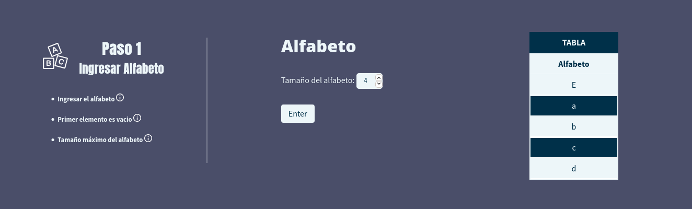
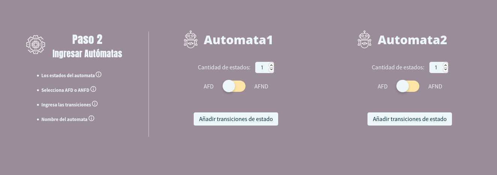
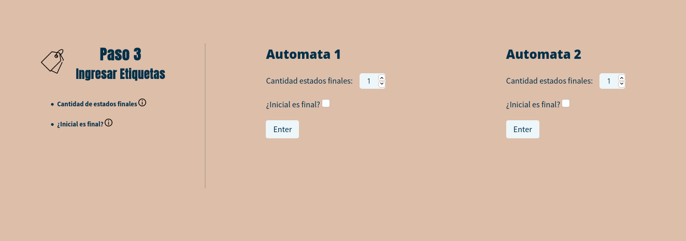
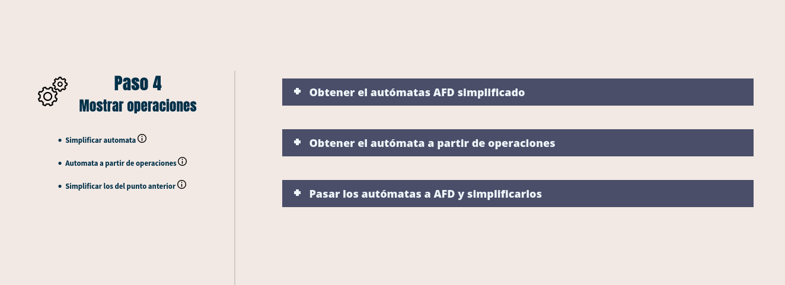

```bash
   ▄████████ ███    █▄      ███      ▄██████▄    ▄▄▄▄███▄▄▄▄      ▄████████     ███        ▄████████    ▄████████ 
  ███    ███ ███    ███ ▀█████████▄ ███    ███ ▄██▀▀▀███▀▀▀██▄   ███    ███ ▀█████████▄   ███    ███   ███    ███ 
  ███    ███ ███    ███    ▀███▀▀██ ███    ███ ███   ███   ███   ███    ███    ▀███▀▀██   ███    ███   ███    █▀  
  ███    ███ ███    ███     ███   ▀ ███    ███ ███   ███   ███   ███    ███     ███   ▀   ███    ███   ███        
▀███████████ ███    ███     ███     ███    ███ ███   ███   ███ ▀███████████     ███     ▀███████████ ▀███████████ 
  ███    ███ ███    ███     ███     ███    ███ ███   ███   ███   ███    ███     ███       ███    ███          ███ 
  ███    ███ ███    ███     ███     ███    ███ ███   ███   ███   ███    ███     ███       ███    ███    ▄█    ███ 
  ███    █▀  ████████▀     ▄████▀    ▀██████▀   ▀█   ███   █▀    ███    █▀     ▄████▀     ███    █▀   ▄████████▀  
                                                                                                                  
```
## Introduction
Esta es una aplicacion web diseñada para el ramo 'Lenguajes y Grafos Formales'<br>

## Uso
### Primero ingresar el alfabeto


### Seguido ingresamos la cantidad de estados del automata y su tipo


### Ingresamos las etiquetas


### Ahora podemos ver las operaciones


<!--
Todo
+ transition acordeon menu when open
-->
